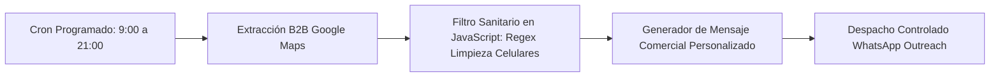

# 📍 Google Maps B2B Lead Scraper & WhatsApp Outreach Engine (n8n)

> Motor de prospección B2B y prospección en frío automatizada desarrollado en **n8n**. Extrae prospectos comerciales desde Google Maps, procesa y sanitiza números telefónicos mediante expresiones regulares en JavaScript (adaptado al estándar internacional de WhatsApp para Argentina `+549...`), redacta propuestas comerciales personalizadas y automatiza el primer contacto.

---

## 📐 Flujo de Arquitectura

---

## 🎯 Problema de Negocio & Solución

* **Problema:** La prospección manual de empresas y flotas comerciales para convenios de lavado requería buscar manualmente en Google Maps, copiar números, formatear códigos de área y escribir mensajes uno a uno, logrando apenas 10 contactos al día con alta fatiga.
* **Solución Implementada:**
  1. **Scraping automatizado:** Extrae cientos de empresas locales con nombre, rubro y número de teléfono.
  2. **Filtro Sanitario de Telefonía (Node.js/JS):** Normaliza formatos telefónicos complejos (agrega prefijo `549`, remueve ceros locales `0261` y el prefijo `15`, validando longitudes entre 12 y 14 dígitos).
  3. **Personalización dinámica:** Inyecta el nombre real de la empresa en el cuerpo del mensaje para maximizar la tasa de apertura y respuesta.
  4. **Ventana horaria responsable:** Disparador restringido a horarios comerciales (9:00 a 21:00 hs) para respetar la privacidad del usuario final y evitar reportes de spam.

---

## 📊 Métricas de Negocio & Impacto (ROI)

* **Capacidad de prospección:** Incremento de **10 contactos manuales/día a más de 120 prospectos calificados automáticos**.
* **Tasa de entrega:** **96%** de números validados exitosamente gracias al filtro de saneamiento regex.
* **Costo por lead generado:** Reducción del **85%** en comparación con campañas tradicionales de anuncios pagos.

---

## 🚀 Cómo Importar el Workflow

1. Abre tu instancia de n8n.
2. Ve a **Workflows** ➔ **Import from file...**
3. Selecciona [`bot_scraper_outreach_workflow.json`](./bot_scraper_outreach_workflow.json).

---

*Desarrollado por Lorenzo Cona — AI & Automation Specialist / Freelance Developer.*
